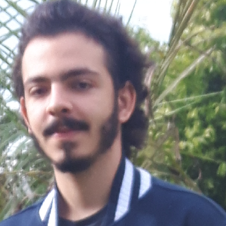
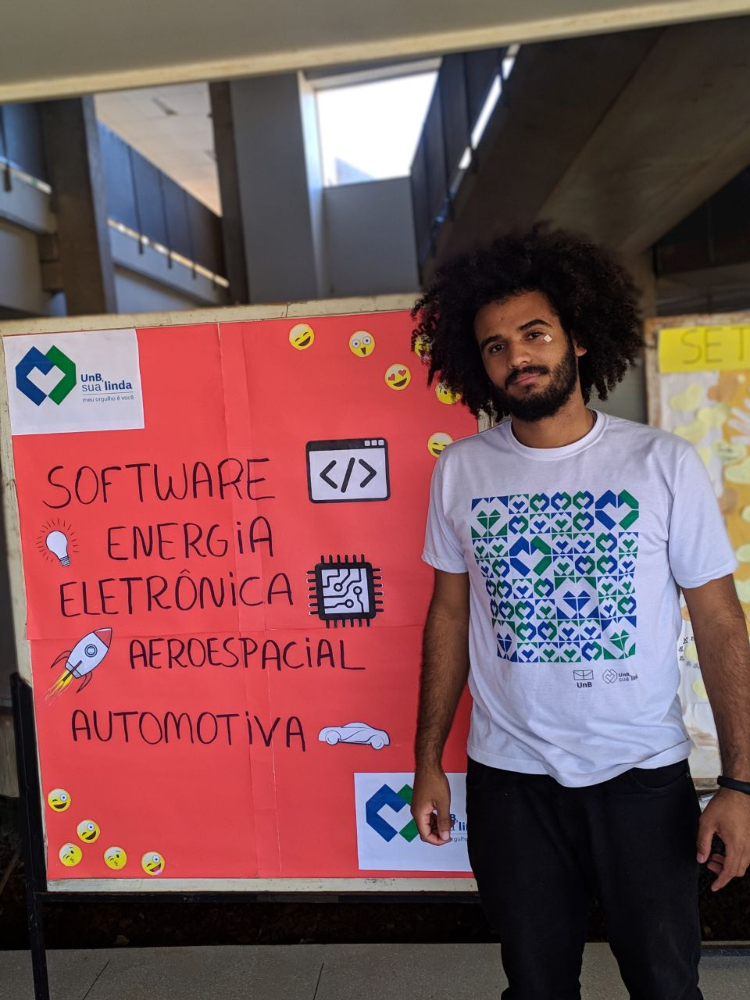
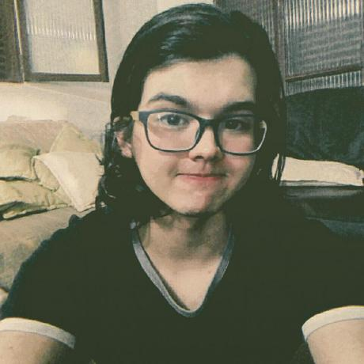
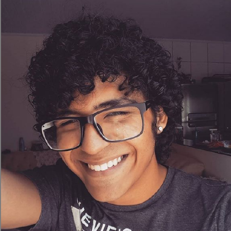

# 2020.2-forumPiR2

&nbsp;&nbsp;&nbsp;&nbsp;Este repositótio tem por objetivo documentar as técnicas de usabilidades aplicadas pelo grupo 8, de Interação Humano Computador da Universidade de Brasília 
campus Gama período 2020/2, ao site Fórum Pir2. Além de poder possuir conteudos relacionados as atividades exercidas na matéria.

Clique [Aqui](https://pir2.forumeiros.com/) para acessar o portal.

# Contribuidores

|Foto|Matrícula | Nome | GitHub | E-mail|
|:--:|:--:|:--:|:--:|:--:|
| | 18/0033620 | Joao Henrique | [joaoHenrique12](https://github.com/JoaoHenrique12) |joao.henrique1299@hotmail.com 
 | | 18/0011600 | Ailton Aires | [ailtonaires](https://github.com/ailtonaires) | ailtonaires5@gmail.com
| | 18/0028685 | Victor Samuel | [victordsantoss](https://github.com/victordsantoss) | victor.samuelsantoss@gmail.com
| | 17/0161871  | Denniel William | [Denniel-sudo](https://github.com/Denniel-sudo) | dennielwilliamr.email@gmail.com
| | 18/0022237 | Liverson Paulo | [liversonp](https://github.com/liversonp)| liverson.p@gmail.com
