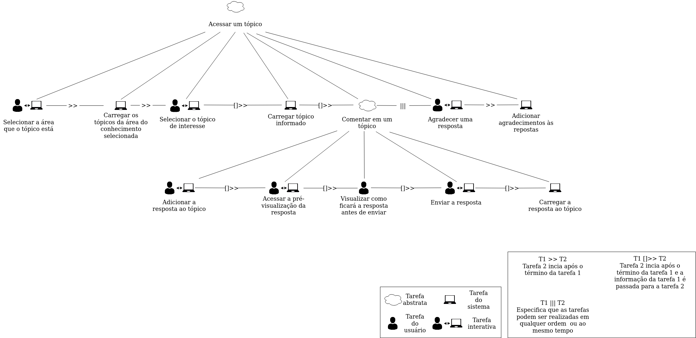
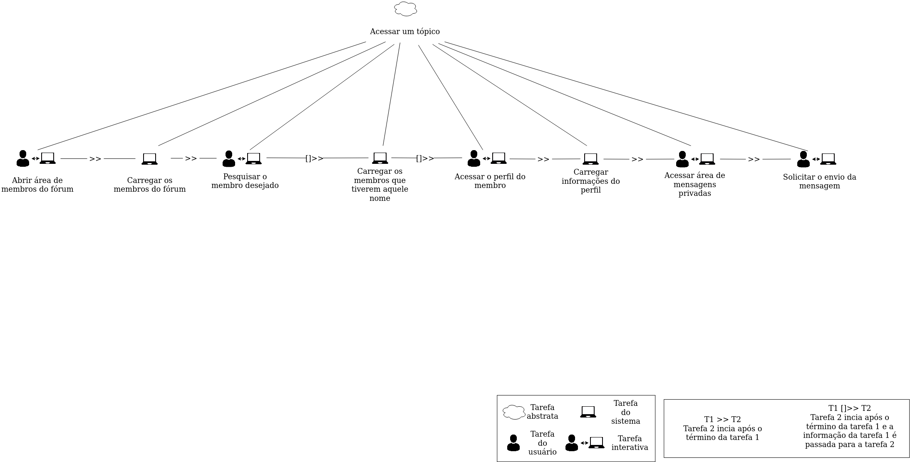

# Árvore de tarefas concorrentes

## Histórico de Versão

| Data       | Versão | Descrição        | Autor(es)      |
| ---------- | ------ | ---------------- | -------------- |
| 28/05/2021 | 0.1    | Criação do documento| Liverson Paulo |

## Introdução

A finalidade de uma árvore de tarefas concorrentes foi criada com a finalidade de auxiliar a avaliação e o design e a avaliação de IHC. Nesse modelo existem 4 tipos de tarefas:

- Tarefas do usuário, realizadas fora do sistema;
- Tarefas do sistema, em que o sistema realiza um processamento sem interagir com o usuário;
- Tarefas interativas, em que ocorrem diálogos usuário-sistema;
- Tarefas abstratas, que não são tarefas em si, mas sim uma representação de uma composição de tarefas que auxilie a decomposição

Assim como a análise de tarefas haverão diferentes níveis hierárquicos.

## Nomenclaturas utilizadas no CTT
Foi demonstrado como seriam as atividades com árvores de tarefas concorrentes (CTT), onde alguns símbolos foram utilizados para poder representar a ordem das tarefas. Sendo eles:

- T1 >> T2: Tarefa 2 iniciará após o término da tarefa 1
- T1 ||| T2: Especifica que as tarefas 1 e 2 podem ser realizadas em qualquer ordem ou ao mesmo tempo
- T1 []>> T2: Tarefa 2 iniciará após o término da tarefa 1 e a informação da tarefa 1 é passada para a tarefa 2.

## CTT Acesso ao tópico

## CTT Mensagem privada

## Referências bibliográficas

- BARBOSA, Simone; SILVA, Bruno. "Interação Humano-Computador". Elsevier Editora Ltda, 2010.