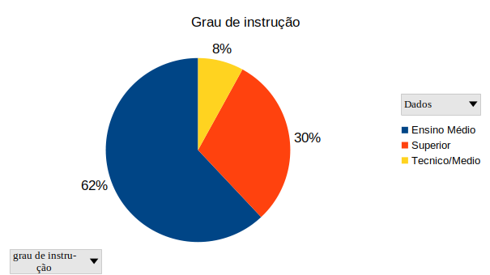
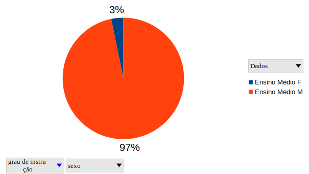
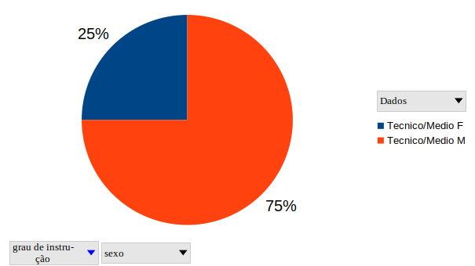
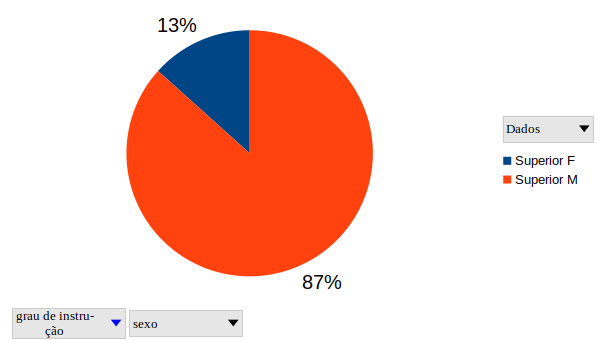
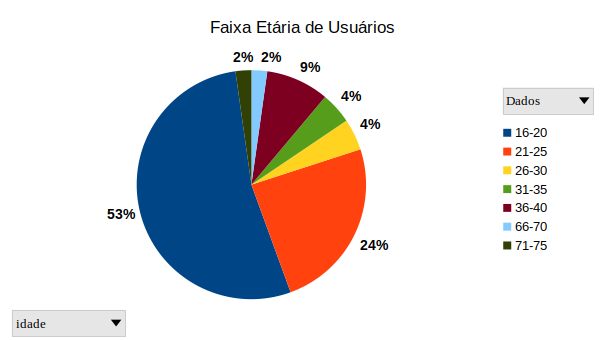
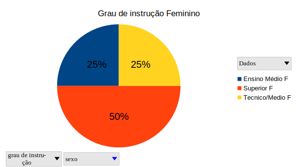
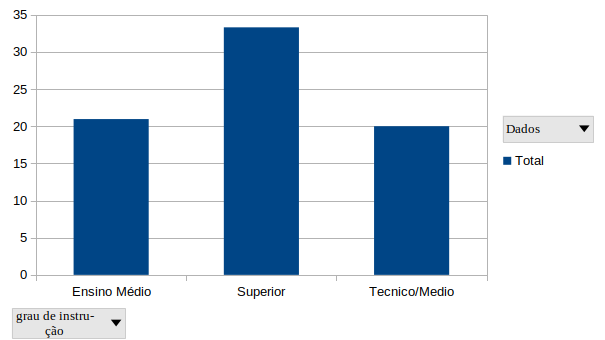

# Perfil de Usuário

## Histórico de Versão

| Data       | Versão | Descrição                        | Autor(es)       |
| ---------- | ------ | -------------------------------- | --------------- |
| 15/03/2021 | 0.1    | Criação do documento             | Denniel William |
| 15/03/2021 | 0.2    | Introdução, Objetivo             | Denniel William |
| 18/03/2021 | 0.3    | Metodologias, Grupos de Usuários | Denniel William |

## 1. Introdução

Este documento irá explorar as características de usuários e não usuários do site educacional Pir2. De acordo com Courage e Baxter, o primeiro passo para registrarmos nosso entendimento sobre os usuários e traçarmos um perfil deles. Quem são? Quais são seus objetivos? nos ajudando, também, a entender para quem estamos construindo o produto, auxiliando no recrutamento de participantes para futuras atividades.

## 2. Objetivo

O objetivo deste documento é traçar um perfil de usuário com base nas caracteristicas deferida do site e de pesquisas do público alvo.

## 3. Metodologias

A escolha do fórum pir2 foi devido a sua presença como um estudo de apoio para estudantes variando entre os assuntos do fórum de nível médio até fundamental. Pelo fórum possuir um acesso livre de intuito educativo a metodologia utilizada se deu ao acesso de cerca de 50 contas e criando um gráfico com a relação de usuários por sexo, grau de instrução e faixa etária. Todos eram fornecidos pelo site ao abrir o perfil de um usuário.

## 4. Grupo de Usuários

O grupo de usuários do fórum se divide entre 3 graus de instruções, sendo de nível médio, técnico e superior. O site possui 250544 usuários registrados tendo sido postadas 606602 mensagens postadas nos seus fóruns. A proporção dos graus de instruções podem ser deferidas abaixo.

62% corresponde a alunos de nível médio, 30% correspondem a alunos de nível superior e somente 8% possui nível técnico.

## Graficos inferidos

### Sexo dos alunos do Ensino medio

### Sexo dos alunos do Ensino Tecnico

### Sexo dos alunos do Ensino Superior

### Faixa etaria dos usuarios

### Grau de instrucao dos usuarios femininos

### Grau de instrucao dos usuarios masculinos

### Faixa etaria media por grau de instrucao

### Relacao geral de sexo de usuarios

### Referências Bibliográficas

- BARBOSA, Simone; SILVA, Bruno. "Interação Humano-Computador". Elsevier Editora Ltda, 2010.