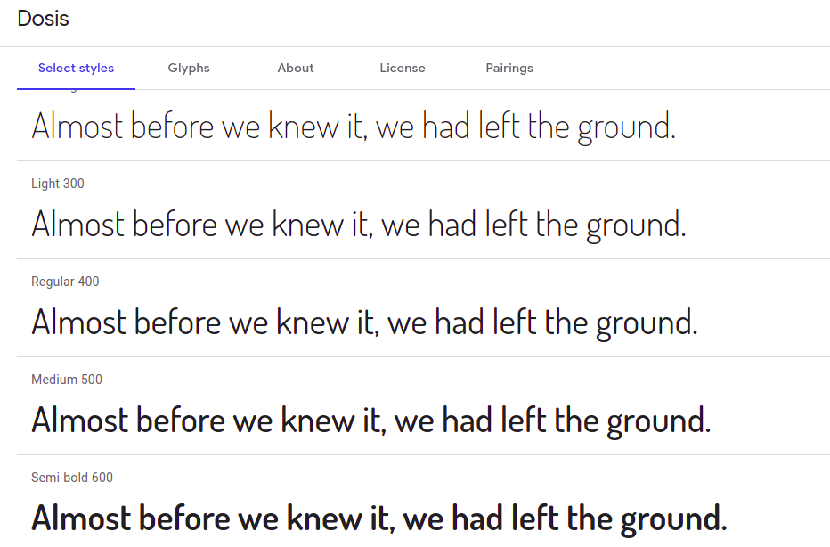

# Guia de estilos

### Histórico de versões
| Data | Versão | Descrição | Autor |
| :--- | :--- | :--- | :--- |
| 25/03/2021 | 0.1 | Criação do Documento, introducao, contexto do projeto, principais referencias bibliograficas | João Henrique|
| 26/03/2021 | 0.1 | Adicionando informações tipográficas, paleta de cores e vocabulário| Liverson Paulo |
| 25/03/2021 | 1.0 | Adicao das linguagens e identificacao dos topicos , sub topicos e argumentacao para tipografia| João Henrique|

## 1 Introducao

Por que usar um guia de estilos em um projeto ? Ou melhor, o que e um guia de estilos ? Quais seus
objetivos ? Bem, um guia de estilos em projetos de UX Design, sao de certa forma manuais que buscam
padronizar certas caracteristicas das interfaces, isto com o intuito de manter a identidade visual
do sistema. Em projetos de software onde existem diversos designer e natural que hajam assimetrias
de pensamentos para concepcao de interfaces, o que pode consequentemente quebrar as expectativas
dos usuarios na transicao de funcoes do produto. Portanto para evitar uma grande perca de identidade
visual do proteto, o que acarreta na quebra de expectativas do usuario sao usados os guias de estilos.

Porem vale ressaltar que: "A aplicação adequada de boa parte dos
princı́pios e diretrizes depende, em alguma medida, do conhecimento do designer acerca do domı́nio do
problema, dos usuários e das suas atividades nesse domı́nio. Sendo assim, cabe ao designer conside-
rar cuidadosamente se e quais diretrizes são adequadas à sua situação de design, e como elas devem se
manifestar na solução de IHC.", (Barbosa e Silva, 2010)

## 2 Contexto do Projeto

Levando em consideracao as metas de usabilidade expressas no documento metas\_de\_usabilidade.md
e que os membros do forum sao academicos de diferentes niveis que buscam manter total foco em 
suas questoes de matematica, quimica, etc. E essencial ter um design que mantenha correspondencia
com as expectativas do usuario atraves de padronizacao de elementos, assim tornando menor a taxa
de esforco do usuario com o forum, o que privilegia seus recursos cognitivos para a resolucao
de questoes.

## 3 Elementos da Interface

### 3.1 Disposição espacial e grid

Devido ao fato de muitos estudantes acessarem a internet por aparelhos telefonicos, e essencial que
os elementos se adaptem a diferentes tipos de telas. Assim sendo a disposicao dos elemenetos deve ser
responsiva.

### 3.2 Janelas

Dentro da ideia de que cada aba do produto nao deve conter mais que 3 janelas/sub janelas para expor
os elementos o designer tera liberdade para montar a maneira de disposicao destas.

## 3.3 Tipografia

Dado o contexto de aprendizagem do forum e as recomendacoes do gnome developer 
que diz: 
"Diferentes pesos e cores de texto podem e devem ser usados para distinguir
diferentes tipos de informação. Ao mesmo tempo, muitas variantes, tamanhos e pesos 
podem tornar o texto mais difícil de ler e não é uma forma eficiente ou elegante de 
transmitir informações. Faça um esforço para minimizar a gama de variantes, tamanhos 
e pesos de fontes.", optamos pela seguinte fonte:
[Dosis](https://fonts.google.com/specimen/Dosis?preview.text_type=custom), projetada por Impallari Type

  

###Sı́mbolos não tipográficos

### 3.4 Cores
A paleta de cores selecionada foi:

| Cor | Imagem |
|---------|------|
| #288AA0 | | 
| #24262d |  |
| #ffffff |  |
| #e6ffff |  |

### 3.5 Animações
Devido ao escopo simples, não são necessárias animações.

## 4 Elementos de ação

### 4.1 Preenchimento de campos
O usuário deve preencher o campo de login e senha. Caso o usuário crie um tópico, ele deve preencher o título e o escopo do tópico. Caso o usuário crie uma resposta à um tópico, ele deve preencher o título e o escopo da resposta ao tópico.

### 4.2 Seleção
O usuário pode selecionar os textos ou elementos destacados no site.

### 4.3 Ativação
Quando o usuário ativa um tópico, ele segue os fundamentos de usabilidade, dando liberdade ao usuário dentro do site.

## 5 Vocabulario e Padrões

### 5.1 Terminologia
O site faz o uso de palavras mais voltadas para conteúdos e estudos de formas mais gerais, logo se pode encontrar termos que se aprende em qualquer fase do ensino, desde o fundamental até o superior.

### 5.2 Tipos de tela
As telas são: tela de listagem de tópicos, tela de pesquisa de tópicos, tela de visualização de usuário, tela de criação de um tópico e tela de resposta de tópico.

### 5.3 Sequência de diálogos
Deve existir uma confirmação quando o login do usuário for efetuado com sucesso, também deve haver um aviso de quando esse processo tiver dado erro.

### 5.4 Terminologias

Devido a natureza do site ser voltada aos academicos das ciencias exatas, faz-se necessaria
a utilizacao de vocabulario objetivo. As principais terminologias usadas pelos usuarios sao
aprendidas dentro do proprio forum com as explicacoes de outros membros.

### 5.5 Tipos de telas

As principais telas do produto sao: listagem de topicos ou sub topicos; postagem e suas respostas; 
listagem de membros; perfil dos membros.

### 5.6 Sequencias de dialogos

Com o intuito de manter um projeto para os possiveis erros dos usuarios, e essencial que 
hajam confirmacoes no caso de postagens no forum.

## 6 Referencias bibliograficas

BARBOSA, Simone; SILVA, Bruno. "Interação Humano-Computador". Elsevier Editora Ltda, 2010.
https://developer.gnome.org/hig/stable/typography.html.pt\_BR , Acessado em : 25/03/2021
