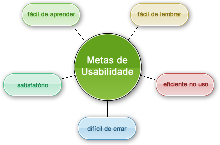

# Metas de Usabilidade 

### Histórico de Versão 

| Data | Versão | Descrição | Autor |
| :--- | :--- | :--- | :--- |
| 24/03/2021 | 0.1 | Criação do Documento | Victor Samuel |
| 25/03/2021 | 0.2 | Implementação inicial do Documento | Victor Samuel |
| 26/03/2021 | 0.3 | Adicionando informações sobre as metas | Liverson Paulo |
| 26/03/2021 | 0.4 | Adicionando sobre as metas em nosso projeto | Liverson Paulo |
| 26/03/2021 | 0.5 | Atualizações nas definições| Liverson Paulo |

## O que são Metas de usabilidade?
O objetivo das metas de usabilidade é definir quais são os fatores de qualidade de uso que devem ser priorizados no projeto, como serão avaliados ao longo do processo de design, e quais faixas de valores são inaceitáveis, aceitáveis ou ideais para cada indicador de interesse. Com frequência, essa priorização se baseia nos indicadores atuais de desempenho dos usuários ao utilizarem o sistema. Usabilidade refere-se a garantir que produtos interativos são fáceis de aprender, efetivas de usar e agrádavel pela perspectiva do usuário. Envolve otimizar as interações que as pessoas têm com produtos interativos para permitir que eles realizem suas atividades no trabalho, na escola e no seu dia a dia (Sharp, Rogers, Preece, 2019). 

## Quais são as Metas de Usabilidade abordadas?
A utilização das metas de usabilidade durante o projeto ajuda a solucionar preocupações como a produtividade do usuário durante a utilização do sistema e motivação desse usuário para um aprendizado eficaz. São elas: 

## Definição das metas

| A Meta | Definição | Pergunta |
| :--- | :--- | :--- |
| Eficácia | A eficácia se refere ao o quanto um produto é bom naquilo que ele quer fazer e o que se espera dele. | O produto permite que as pessoas aprendam, realizem seu trabalho de forma eficiente, acessem a informação de que necessitam ou comprem os produtos que desejam? | 
| Eficiência | É a maneira que um produto auxilia os usuários na realização de suas tarefas. | Os usuários conseguirão manter um alto nível de produtividade, uma vez que tenham aprendido como utilizar um produto para realizar suas tarefas? | 
| Segurança | A segurança envolve proteger o usuário de condições potencialmente perigosas e situações indesejáveis. | Qual é a gama de erros possíveis ao se utilizar o produto e quais as medidas que o produto permite que o usuário tome para corrigir os erros facilmente? | 
| Utilidade | É a medida na qual o produto oferece o tipo certo de funcionalidade, de modo que os usuários possam fazer aquilo que precisam ou desejam. | O produto fornece um conjunto adequado de funções que permitam aos usuários realizar todas as suas tarefas da maneira que desejam? | 
| Aprendizagem | Também é chamada de capacidade de aprendizagem ou learnibility, é a facilidade que um usuário qualquer vai ter de aprender a utilizar este sistema em específico. | O usuário saberá como usar o produto explorando a interface e experimentando determinadas ações? Será difícil aprender todo o conjunto de funções dessa maneira?| 
| Memorização | Capacidade de memorização ou memorability, é a facilidade de lembrar como utilizar um sistema depois de já tê-lo aprendido. | Que tipos de suporte de interface foram fornecidos com o objetivo de ajudar os usuários a lembrarem como realizar as tarefas, especialmente para produtos e operações que são utilizados com pouca frequência? | 

## Metas no PiR2

- Eficácia: O sistema tem uma boa eficácia, pelo fato de haver um escopo relativamente simples, fazendo ser possível cumprir os objetivos propostos

- Eficiência: O nível de produtividade depois de se aprender como executar suas tarefas será alto, salvo alguns tópicos específicos que não ficam tão claros no momento da utilização

- Segurança: Os possíveis erros que podem ocorrer são comunicações feitas de forma errada ou respostas incompletas. Nesse caso é possível fazer uma edição no comentário e atualizá-lo.

- Utilidade: É possível utilizar todas as funcionalidades propostas pelos sistema sem muita dificuldade, por serem propostas simples.

- Aprendizagem: O usuário poderá aprender tranquilamente as funcionalidades do sistema ao testá-los, não ficará perdido em seus funcionamentos e poderá chegar com facilidade ao objetivo.

- Memorização: Um usuário que não é recorrente conseguiria com facilidade reutilizar o sistema sem gargalos, devido à simplicidade do sistema.

## Referências Bibliográficas

- PREECE, Jennifer; ROGERS, Yvone; SHARP, Helen. Design de Interação: Além da Interação humano-computador. Editora Bookman, São Paulo: 2005.

- BARBOSA, Simone; SILVA, Bruno. "Interação Humano-Computador". Elsevier Editora Ltda, 2010.

- Usabilidade - Portal ErikBass - Disponível em: https://erikbass.wordpress.com/
