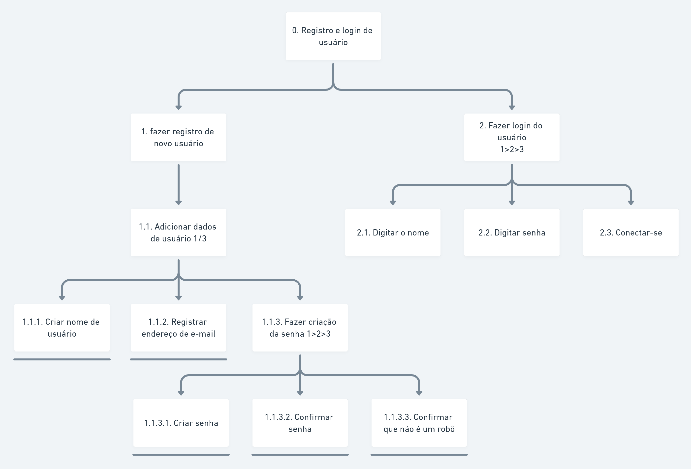
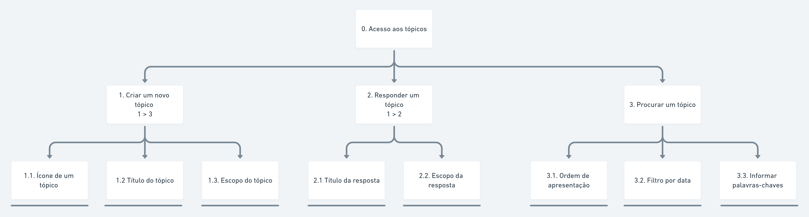

# Análise hierarquica de tarefas

## Histórico de Versão

| Data       | Versão | Descrição        | Autor(es)      |
| ---------- | ------ | ---------------- | -------------- |
| 18/03/2021 | 0.1    | Inicio do escopo | Liverson Paulo |
| 09/04/2021 | 1.1    | Reestruturação do HTA | Denniel William |
| 27/04/2021 | 1.2    | Atualização do documento | Denniel William |

## 1. Introdução

Uma análise de tarefas é utilizada para se ter um entendimento sobre qual é o trabalho dos usuários,
como eles o realizam e por quê. Quando visa a avaliar um sistema computacional existente, a análise de tarefas pode ser bem concreta, descrevendo o comportamento de forma detalhada. Sendo assim, esse documento irá tratar dos resultados coletados da avaliação sobre a análise de tarefas anteriormente proposta. 

## 2. Objetivo

O objetivo desse documento será de transcrever o resultado da avaliação sobre a análise de tarefas, sendo assim, ao seu final, demonstrar um análise de tarefas melhor reestruturada baseada na interação do usuário com a última proposta.

## 3. Metodologia

Foi realizada uma avaliação que consistia dos avaliadores incorporarem as personas dodcumentadas anteriormente percorrendo todos fluxos do site baseado na análise de tarefas anteriormente estabelecida.

Essa avaliação consistia em anotar e sobrescrever a visão da persona baseada em cada página e sua interação com o fluxo da tarefa, sendo assim possível observar diferentes caminhos analisando a complexidade de cada fluxo para uma tarefa e em como isso interagia com o usuário, assim ao final da avaliação iria ser feito a comparação de anotações afim de chegar num fluxo melhor estabelecido.

## 3. Análise Hierarquica de tarefas (HTA)

A HTA examina primeiramente os objetivos de alto nível (por exemplo, marcar uma reunião), decompondo-os em subobjetivos (por exemplo, decidir a data, decidir o local, convidar os participantes etc.) Os planos podem definir diversas relações entre os subobjetivos: sequência fixa (um objetivo deve ser atingido antes do próximo); regra de seleção ou decisão (quais objetivos que deverão ser atingidos dependem das circunstâncias); ou em paralelo (mais de um objetivo deve ser atingido ao mesmo tempo). 

Abaixo segue os novos fluxo das análises de tarefas.

## Diagrama HTA de registro de usuário

## Diagrama HTA de perfil de usuário

## Diagrama HTA de tópicos do fórum

# Referências bibliográficas

- BARBOSA, Simone; SILVA, Bruno. "Interação Humano-Computador". Elsevier Editora Ltda, 2010.
