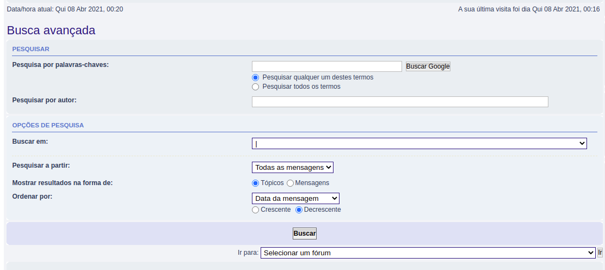

# Planejamento de avaliação

### Historico de Versão

| Data       | Versão | Descrição             | Autor(res)      |
| ---------- | ------ | --------------------- | --------------- |
| 07/04/2021 | 0.1    | Criação do Documento  | Denniel William |

## Introdução

O intuito deste documento é criar um planejamento de uma avaliação de forma a apresentar oportunidades de melhorias na análise hierarquica de tarefas notada no site, facilitando assim uma hierarquia confortável e com conformidade para o usuário.

Ao decorrer desse documento serão apresentado os objetivos a metodologia utilizada chegando posteriormente a avaliação que será aplicada. 

## Objetivo

O objetivo desse documento é seguir com a metodologia proposta a fim de elaborar uma avaliação que se adeque a uma hierarquia de tarefas melhor estrurada e mais amigável ao usuário final, usando assim de dados coletados e forma de coletar os dados para por fim atingir esse objetivo.

## Metodologia

A metodologia utilizada para a estruturação desse documento será baseada no _Framework_ **DECIDE** proposta por Sharp, Rogers e Preece(2007). O _framework_ DECIDE pode ser descrito, de forma sucinta, nos seguintes tópicos: 

* **D** - Determinar os objetivos da avaliação de IHC. 

* **E** - Explorar perguntas a serem respondidas com a avaliação.

* **C** - Escolher (Choose) os métodos de avaliação a serem utilizados.

* **I** - Identificar e administrar as questões práticas da avaliação. 

* **D** - Decidir como lidar com as questões éticas. 

* **E** - Avaliar (Evaluate), interpretar e apresentar os dados. 

## Métodos de avaliação

Será utilizado o método de inspeção Percurso Cognitivo. O objetivo dessa avaliação é encontrar problemas de IHC, sendo esse tipo de método o mais adequado.

## Percurso cognitivo

### Preparação

Como preparação foram definidas 5 personas em que partindo da preparação do método, cada avaliador irá se portar na atividade como uma persona, essas personas são as mesmas definida no documento de persona disponível no repositório. O escopo da aplicação que essa atividade irá tratar será da análise hierarquica de tarefas baseada nos tópicos, sendo esse a principal funcionalidade do site. Os fragmentos do site seguem abaixo: 

**Figura 1.1 - Fragmento do site baseado no HTA de tópicos dos tópicos do fórum** 

**Figura 1.2 - Fragmento do site baseado no HTA de busca dos tópicos do fórum**

### Coleta de dados

Primeiro o usuário deve percorrer a interface de acordo com a sequência de ações necessárias para realizar cada tarefa para cada ação enumerada, analisar se o usuário executaria a ação corretamente, respondendo e justificando a resposta às seguintes perguntas:

  1. O usuário vai tentar atingir o efeito correto? (Vai formular a intenção correta?)

  2. O usuário vai notar que a ação correta está disponı́vel?

  3. O usuário vai associar a ação correta com o efeito que está tentando atingir?

  4. Se a ação for executada corretamente, o usuário vai perceber que está progredindo na direção de concluir a tarefa?

Após os demais passos o usuário deve relatar uma história aceitável sobre o sucesso ou falha em realizar cada ação que compõe a tarefa

### Interpretação e consolidação de resultados

Dos resultados avaliados os avaliadores devem sintetizar resultados sobre os seguintes casos: 

* O que o usuário precisa saber a priori para realizar as tarefas? 

* O que o usuário deve aprender enquanto realiza as tarefas?

### Relato dos resultados

Gerar resultados consolidados com os problemas encontrados e formular soluções e sugestão de correções.

### Referências Bibliográficas

BARBOSA, Simone; DINIZ, Bruno. **Interação Humano-Computador**, Editora Elsevier, Rio de Janeiro, 2010.

