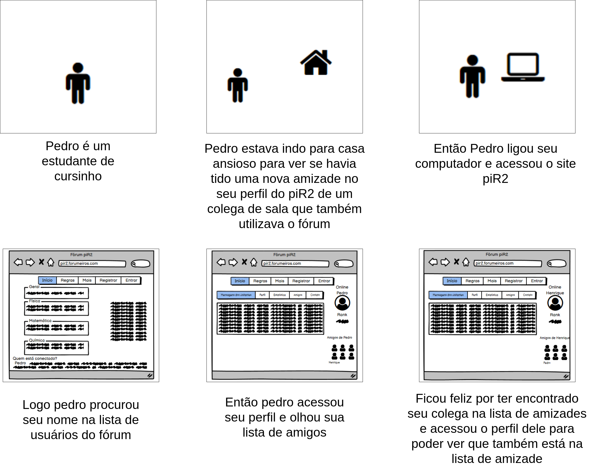

# Storyboard

### Histórico de versão

| Data       | Versão | Descrição                     | Autor(res)     |
|------------|--------|-------------------------------|----------------|
| 08/04/2021 | 0.1    | Criação do Documento          | Liverson Paulo |
| 08/04/2021 | 0.2    | Adição de tabela e Storyboard | Liverson Paulo |
| 08/04/2021 | 0.3    | Adição de tabela sobre Resposta de um tópico e adição do story board de user profile | João Henrique Paulino |

## 1. Introdução

Um protótipo de baixa-fidelidade, vai ser aquele que demonstra a finalidade do produto, porém não vai parecer tanto com sua versão final, podendo por exemplo utilizar outros itens para representar os que irão realmente ser utilizados no projeto final. Porém esses protótipos são úteis por serem simples, baratos e de rápida produção, sendo assim uma vantagem importante para o desenvolvimento.

## Storyboard

É um tipo de protótipo de baixa-fidelidade, onde são geralmente utilizados conjuntos de cenários que vão representar como um usuário vai poder progredir em uma tarefa, podendo ser representado por uma série de telas esboçadas ou uma série de cenas desenhadas mostrando como um usuário pode desempenhar uma tarefa utilizando um produto.

| Atividade | Tarefa | Definição |
|--|--|--|
| Preparo | Definição das pessoas envolvidas | João e Felipe |
|  | Definição do ambiente da história | Casa de João |
|  | Definição da tarefa que será abordada | Realizar a criação de um tópico no Fórum piR2 |
| Sequência | Definição de quais passos estão envolvidos para cada realização de tarefa | 1- Acessar o site / 2- Fazer login / 3- Clicar em fórum / 4- Criar um novo tópico |
|  | Definição do que leva a pessoa a usar a aplicação | Realizar a criação de um tópico para sanar uma dúvida sobre um conteúdo específico |
|  | Definição de qual é (e como) a tarefa será ilustrada| Fazer a criação de um tópico, será ilustrado com um usuário tendo que criar um tópico para poder tirar suas dúvidas com outros usuários, pois é o meio mais fácil para conseguir fzer isso |
| Satisfação | Definição da motivação principal da pessoa que usa a aplicação | Ter um acesso fácil a informações, caso não encontre a informação pode postar um tópico sobre tendo a certeza de que algum usuário irá responder |
|  | Definição das realizações que a aplicação permite | O conforto de poder fazer isso em casa sem ter que se deslocar para alguma biblioteca ou tentar entrar em contato com o professor da matéria, que pode estar indisponível |
| | Definição das necessidades que a aplicação se propõe a sanar | A necessidade de precisar do contato de alguém para sanar as dúvidas fora da sala de aula sem precisar se deslocar, nem precisar entrar em contato especificamente com alguém em específico |

## Storyboard de novo tópico

Este storyboard foi feito utilizando o aplicativo [balsamiq](https://balsamiq.com/wireframes) e o site draw.io

## Storyboard respondendo um tópico

| Atividade | Tarefa | Definição |
|--|--|--|
| Preparo | Definição das pessoas envolvidas | Felipe  e João|
|  | Definição do ambiente da história | Casa de Felipe |
|  | Definição da tarefa que será abordada | Responder um tópico no Fórum piR2 |
| Sequência | Definição de quais passos estão envolvidos para cada realização de tarefa | 1- Acessar o site / 2- Fazer login / 3- Clicar em fórum / 4- Acessar um tópico / 5- Responder o tópico |
|  | Definição do que leva a pessoa a usar a aplicação | Colocar seus conhecimentos em pática, ajudando algem. |
|  | Definição de qual é (e como) a tarefa será ilustrada| Responder um tópico será ilustrado com um usuário acessando um tópico  e sanando dúvidas de outros usuários |
| Satisfação | Definição da motivação principal da pessoa que usa a aplicação | As motivações são variadas para ajudar outro ser humano com conhecimento técnico, vai desde o sentimento de altruísmo até a necessidade de colocar em prática conhecimentos adquiridos em sua formação. |
|  | Definição das realizações que a aplicação permite | Fácil contato com estudantes que buscam auxílio em questões quais o usuário pode ajudar, assim fazendo com que o mesmo se sinta como parte de uma comunidade. |
| | Definição das necessidades que a aplicação se propõe a sanar | Procura de dúvidas que ponham em prática a expertise do usuário. |

Este storyboard foi feito utilizando o aplicativo [balsamiq](https://balsamiq.com/wireframes) e o site draw.io

## Storyboard user profile

| Atividade | Tarefa | Definição |
|--|--|--|
| Preparo | Definição das pessoas envolvidas | ... |
|  | Definição do ambiente da história | ... |
|  | Definição da tarefa que será abordada | ... |
| Sequência | Definição de quais passos estão envolvidos para cada realização de tarefa | ... |
|  | Definição do que leva a pessoa a usar a aplicação | ... |
|  | Definição de qual é (e como) a tarefa será ilustrada| ... |
| Satisfação | Definição da motivação principal da pessoa que usa a aplicação | ... |
|  | Definição das realizações que a aplicação permite | ... |
| | Definição das necessidades que a aplicação se propõe a sanar | ... |

## Referências
  
- Sommerville, Ian. Engenharia de Software. 9a Edição. Pearson.
- BARBOSA, Simone; DINIZ, Bruno. Interação Humano-Computador, Editora Elsevier, Rio de Janeiro, 2010.
- SHARP, Helen; ROGERS, Yvonne; PREECE, Jenny. "INTERACTION DESIGN beyond human-computer interaction". John Wiley & Sons, 2019.
