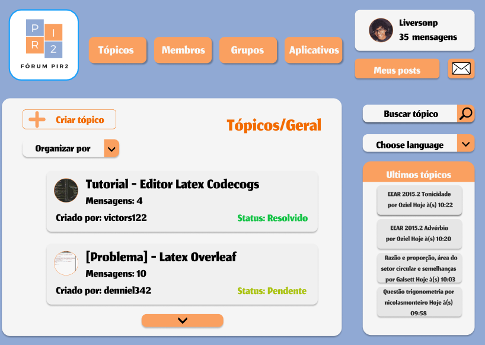

# Protótipo de Alta Fidelidade

### Historico de Versão

| Data       | Versão | Descrição             | Autor(res)      |
| ---------- | ------ | --------------------- | --------------- |
| 28/04/2021 | 0.1    | Criação do Documento e Inserção das Telas  | Victor Samuel, Denniel William e Liverson Paulo  |

## Sobre o Documento

"A fidelidade do protótipo refere-se ao nível de detalhes e funcionalidade incorporada a ele. Nesse sentido, um protótipo de alta fidelidade (às vezes chamado de high-fi ou hi-fi) é uma representação interativa do produto, baseada no computador ou em dispositivos móveis. Esse protótipo já apresenta maior semelhança com o design final em termos de detalhes e funcionalidade."
Fonte [Medium](https://medium.com/somos-tera/prototipagem-de-alta-fidelidade-635d745b662b).

Com isso, o Protótipo de Alta Fidelidade vem com o objetivo de:
* Representar fielmente o novo produto digital, tanto em relação às funcionalidades quanto à estética e comportamento;
* Apresentar detalhes das operações e suas extensões, como funcionalidades de botões e possíveis retornos de erros;
* Conter as possíveis e diferentes etapas percorridas pelos usuários;
* Normalmente é interativo e navegável.

## O Protótipo 

A prototipagem de Alta Fidelidade foi feita com base no fluxo de criação de tópicos usando a Plataforma [FIGMA](https://www.figma.com/)

### Tela Inicial 

  

### Tópicos Geral

  

### Dentro do Tópico

  

### Mensagem Enviada

  

### Novo Post 

  

*As Páginas estarão disponíveis para interação dentro da plataforma FIGMA*, acessível clicando [AQUI](https://www.figma.com/proto/SphBQCvwj6qVWP2YLDiPVs/Untitled?node-id=1%3A2&scaling=contain&page-id=0%3A1).

## Referências Bibliográficas 

* BARBOSA, Simone; SILVA, Bruno. "Interação Humano-Computador". Elsevier Editora Ltda, 2010.
* Protótipo de Baixa e Alta Fidelidade - Portal [SoftDesign] (https://softdesign.com.br/blog/prototipo-baixa-e-alta-fidelidade/)
* Prototipagem de Alta Fidelidade - Portal [Medium](https://medium.com/somos-tera/prototipagem-de-alta-fidelidade-635d745b662b)

