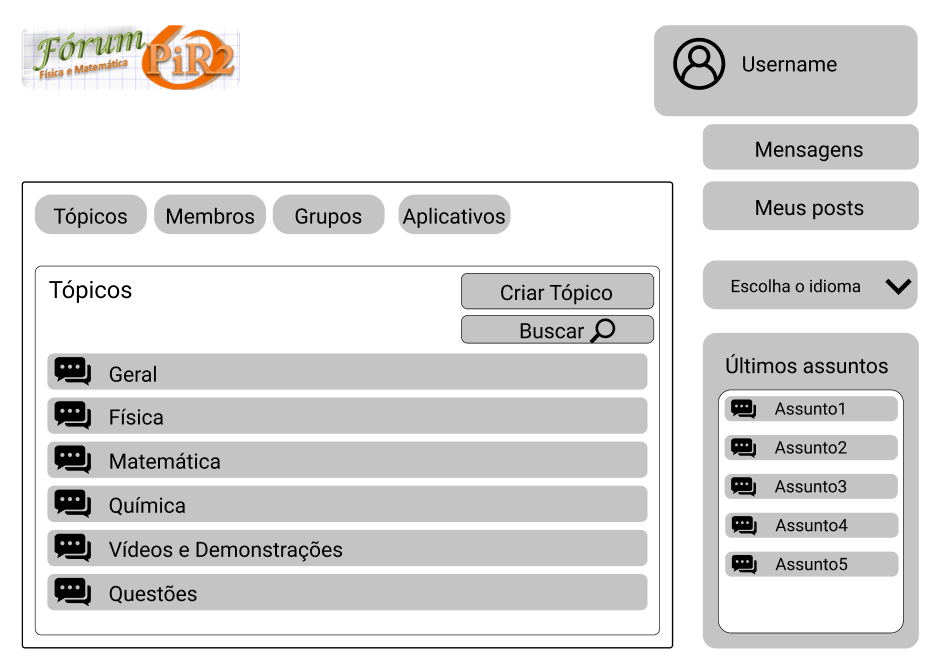
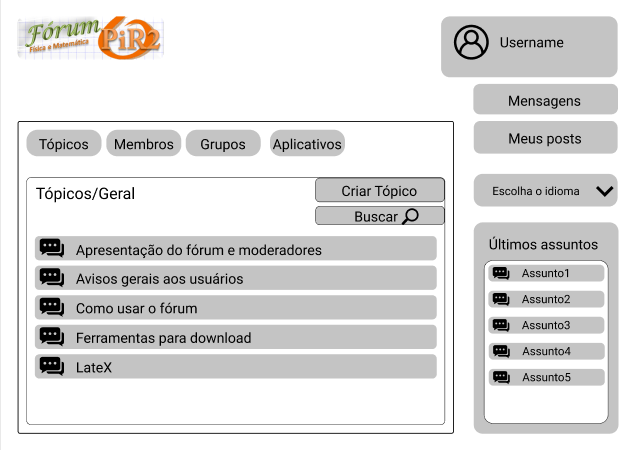
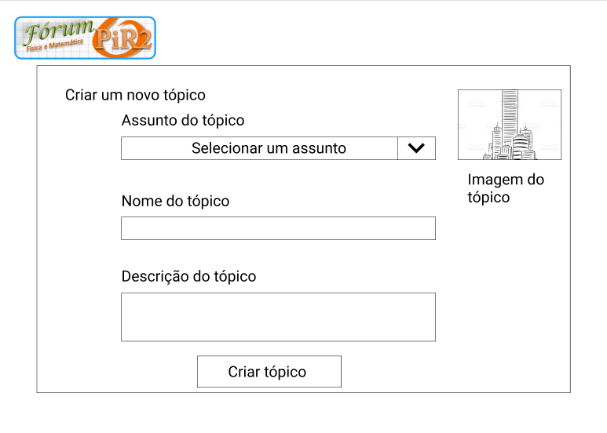
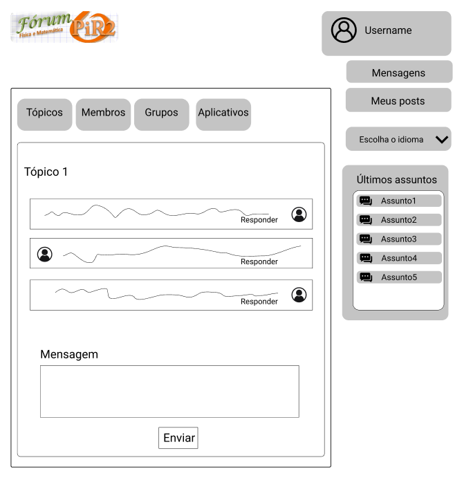

# Protótipo de Baixa Fidelidade

### Historico de Versão

| Data       | Versão | Descrição             | Autor(res)      |
| ---------- | ------ | --------------------- | --------------- |
| 28/04/2021 | 0.1    | Criação do Documento e Inserção das Telas  | Victor Samuel, Denniel William e Liverson Paulo  |
| 29/04/2021 | 0.2   | Revisão  | Victor Samuel, Denniel William e Liverson Paulo  |
| 11/05/2021 | 0.3  | Correção no Pages  | Victor Samuel |

## Sobre o Documento
Ao desenvolver um protótipo para uma determinada aplicação, não é necessário apresentar toda funcionalidade do produto, ou o produto 100% desenvolvido. Com isso, os protótipos servem para melhorar, alterar ou incrementar um solução que ainda será lançada futuramente, nesse contexto, o Protótipo de Baixa Fidelidade aparece, ele apresenta caracterìsticas como baixo nível de detalhamento, apresenta visualmente funcionalidades básicas (mas indispensáveis), não possui recursos de interação e não exibe necessariamente o mesmo design da versão final. 

Com isso, o Protótipo de Baixa Fidelidade vem com o objetivo de:

* Iniciar validações visuais;

* Iniciar validações funcionais;

* Detalhar inicialmente possíveis mudanças;

* Iniciar interatividade e caminhos de navegação;

## O Protótipo 

A prototipagem de Baixa Fidelidade foi feita com base no fluxo de criação de tópicos usando a Plataforma [FIGMA](https://www.figma.com/)

### Tela Inicial 

### Tópicos Geral

### Criar Tópico

### Acesso ao Assunto nos Tópicos

*As Páginas estarão disponíveis para interação dentro da plataforma FIGMA*, acessível clicando [AQUI](https://www.figma.com/proto/PTWZzhjcBSBzPOqtIBMaGV/Prot%C3%B3tipo-de-Baixa-Fidelidade-F%C3%B3rum-Pir2?page-id=0%3A1&node-id=19%3A3&viewport=254%2C280%2C0.22335600852966309&scaling=scale-down).

## Referências Bibliográficas 

* BARBOSA, Simone; SILVA, Bruno. "Interação Humano-Computador". Elsevier Editora Ltda, 2010.
* Protótipo de Baixa e Alta Fidelidade - Portal [SoftDesign] (https://softdesign.com.br/blog/prototipo-baixa-e-alta-fidelidade/)
* Prototipagem de Alta Fidelidade - Portal [Medium](https://medium.com/somos-tera/prototipagem-de-alta-fidelidade-635d745b662b)

